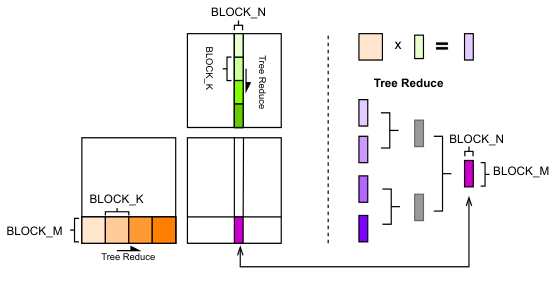
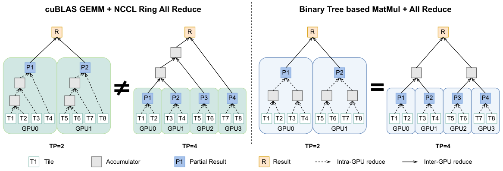

# TBIK: Tree Based Invariant Kernels
Implementation of [Appeasing Machine Spirits: Deterministic LLM Inference across Tensor Parallel Sizes]()


## Overview

The fundamental source of nondeterminism in LLM serving systems is the non-associativity of floating-point arithmetic combined with variations in kernel execution order. Recent work from Thinking Machines Lab introduced batch-invariant operators, which ensure deterministic outputs across different batch sizes. However, tensor parallelism introduces another source of nondeterminism: matrix multiplication often uses a split-K parallel strategy, causing model outputs to vary with different TP sizes.

<p align="center">
  
</p>

<p align="center">
  <i>Illustration of TP-invariant matrix multiplication under the split-K parallel strategy.</i>
</p>

We propose TBIK, a TP-invariant matmul method that achieves determinism by strictly controlling the reduction order in matrix multiplications. By replacing TP-size-sensitive(Row-Split) layers such as o_proj and down_proj with our TP-invariant counterparts, and by employing a tree-structured cross-GPU all-reduce, we achieve fully deterministic LLM inference across different TP sizes.

Furthermore, we align the training engine (TP=1) with the inference engine (TP>1), enabling bitwise-identical true on-policy reinforcement learning.

<p align="center">
  
</p>

<p align="center">
  <i>Illustration of global reductions within and across GPUs for Row-Split layers in Transformer Models.</i>
</p>


## Setup
1. Install vllm
```bash
conda create -n tbik python=3.12 -y
conda activate tbik
pip install vllm==0.11.0
```
<!-- 2. Install dependencies
```bash
pip install datasets latex2sympy2 word2number immutabledict nltk langdetect
``` -->

2. Install Torchtitan and Flash Attention(This is optional unless you want to try `simple_rl.py`)
```bash
# Flash Attention
pip install flash-attn --no-build-isolation
# Torchtitan
git clone https://github.com/xh-ding/torchtitan.git
cd torchtitan
pip install -e .
cd ..
```

3. Download TBIK repository
```bash
git clone git@github.com:xh-ding/TBIK.git
cd TBIK
```

## How to try TBIK?
Unlock deterministic vLLM inference and true policy reinforcement learning with just a single, lightweight `apply_patches()` function! It automatically applies the appropriate patches based on the environment variables.

### Deterministic Matmul
The root cause of TP non-invariance in LLM serving systems is that matmul operations using the split-K parallelization strategy introduce nondeterministic reduction orders. With our tree-based matmul, the result of matrix multiplication remains invariant regardless of the number of splits. You can switch between the standard matmul and the tree-based matmul by setting `TP_INVARIANT_MATMUL=0/1`.
```bash
TP_INVARIANT_MATMUL=1 python simple_matmul.py
```

### Deterministic LLM inference
In vLLM’s model implementation, the `o_proj` layer in the attention module and the `down_proj` layer in the FFN use 'row-split' linear layers, whose matrix computations rely on split-K parallelism. By replacing these row-split linear layers with our TP-invariant counterparts and co-designing both the intra-kernel reduction order and the inter-GPU reduction order(and also batch invariant operations), vLLM can achieve deterministic inference across different runtime settings.
```bash
VLLM_BATCH_INVARIANT=1 VLLM_TP_INVARIANT=1 python simple_inference.py
```

### Bitwise consistent on-policy RL
Following [spirl](https://github.com/bwasti/spirl), we use vLLM for inference and TorchTitan for training in our demo code to make the workflow easier to try for users. In practical RL training pipelines, the training engine typically runs with FSDP (TP = 1), while the inference engine runs with TP > 1. This mismatch in numerical precision across the two engines is the fundamental cause of training instability in RL. By introducing TBIK and aligning the operators used in both the training and inference engines, we address this issue at its root, making true on-policy RL feasible.
```bash
[CUDA_VISIBLE_DEVICES] VLLM_BATCH_INVARIANT=1 VLLM_TP_INVARIANT=1 ALIGN_TRAIN_INFERENCE=1 python simple_rl.py
```

## Contributing
The code was currently tested with Qwen3-1.7B, should work with other Qwen3 models with the same architecture.

We welcome contributions from the research community to improve TBIK. If you have any idea or would like to report a bug, please open an issue or submit a pull request.


## Citation

If you find our work helpful, please kindly cite our paper.

```bibtex

```

## Acknowledgment
Our implementation of `simple_rl.py` and `torchtitan` is adapted from [spirl](https://github.com/bwasti/spirl) repository.